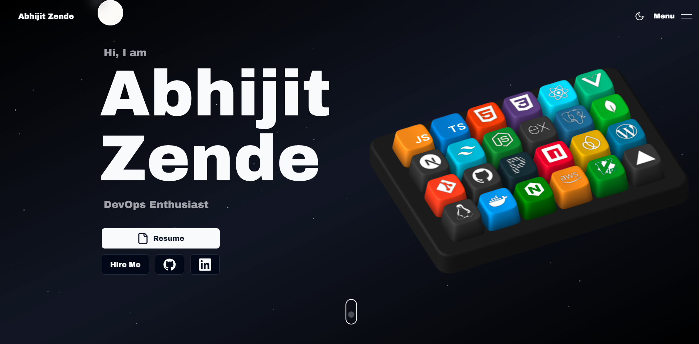

# 🚀 Rupam Karmakar's 3D Portfolio

[](https://rupamkarmakar.vercel.app)
[](https://www.linkedin.com/in/0xrupamp26/)
[](https://github.com/0xrupamp26)
[](https://twitter.com/0xrupamp26)



Welcome to my interactive 3D portfolio website! This project showcases my skills, projects, and experience in an engaging and visually appealing way.

## 🚀 Live Demo

Check out the live version: [https://rupamkarmakar.vercel.app](https://rupamkarmakar.vercel.app)

## ✨ Features

### 🎨 Modern UI/UX
- Clean, responsive design that works on all devices
- Dark/light mode support
- Smooth animations and transitions

### 🛠️ Tech Stack
- **Frontend**: Next.js 13+, React 18+, TypeScript
- **Styling**: Tailwind CSS
- **Animations**: Framer Motion, GSAP
- **3D Elements**: Three.js, Spline
- **Deployment**: Vercel

### 📱 Sections
- Hero section with animated 3D elements
- Skills showcase with interactive components
- Project gallery with filtering
- Contact form with form validation
- Blog section (coming soon)

## 🏗️ Getting Started

### Prerequisites
- Node.js 18+ and npm/yarn
- Git

### Installation

1. Clone the repository:
   ```bash
   git clone https://github.com/0xrupamp26/3d-portfolio.git
   cd 3d-portfolio
   ```

2. Install dependencies:
   ```bash
   npm install
   # or
   yarn install
   ```

3. Start the development server:
   ```bash
   npm run dev
   # or
   yarn dev
   ```

4. Open [http://localhost:3000](http://localhost:3000) in your browser.

## 📝 Customization

1. Update your personal information in `src/data/config.ts`
2. Modify the color scheme in `tailwind.config.js`
3. Add your projects in `src/data/projects.ts`
4. Update your skills in `src/data/skills.ts`

## 🤝 Contributing

Contributions are welcome! Please feel free to submit a Pull Request.

## 📄 License

This project is licensed under the MIT License - see the [LICENSE](LICENSE) file for details.

## 🙏 Acknowledgments

- Inspired by various portfolio designs and templates
- Built with amazing open source libraries

### 📱 **Responsive Design**
- Fully responsive layout ensures the website looks and functions beautifully on all devices.
- Optimized for both desktop and mobile experiences.

### 🧠 **Innovative Web Design**
- Combines cutting-edge technology with an intuitive user experience.
- Creative use of animations and visuals to push the boundaries of modern web design.

## 🛠️ Tech Stack

The portfolio website is built using the following tools and technologies:

- **Frontend:** Next.js, React, Tailwind CSS, Shadcn, Aceternity UI
- **Animations:** GSAP, Framer Motion, Spline Runtime
- **Other Tools:** Resend, Socket.io, Zod

## 🌟 Getting Started

1. Clone this repository:
   ```bash
   git clone https://github.com/Abhiz2411/3D-interactive-portfolio.git
   ```

2. Navigate to the project directory:
   ```bash
   cd 3D-interactive-portfolio
   ```

3. Install dependencies:
   ```bash
   npm install
   ```

4. Set up environment variables:
   ```bash
   # Create a .env.local file in the root directory
   touch .env.local

   # Add your Resend API key
   RESEND_API_KEY=your_resend_api_key_here
   ```

5. Start the development server:
   ```bash
   npm run dev
   ```

6. Open your browser and navigate to:
   ```
   http://localhost:3000
   ```

## 🚀 Deployment

This project is deployed using **Vercel** for its blazing-fast performance and ease of use. You can view the live site [here](https://www.abhijitzende.com/).

### Setting up Resend API on Vercel

1. Sign up for a [Resend](https://resend.com) account and get your API key
2. Go to your Vercel project settings
3. Navigate to the "Environment Variables" section
4. Add a new environment variable:
   - Name: `RESEND_API_KEY`
   - Value: Your Resend API key
5. Save the changes and redeploy your application

Note: Make sure to keep your API key secret and never commit it to your repository.

## 💖 Acknowledgments

A huge shoutout to [Naresh Khatri](https://github.com/Naresh-Khatri/Portfolio) for the inspiration and ideas that sparked this journey! 💡 If you're interested in creative web design, definitely check out his work.

## 📬 Contact

Feel free to reach out to me for collaboration, feedback, or just to say hi! 😊

- **Email:** abhijitzende75@gmail.com
- **LinkedIn:** [Your LinkedIn Profile](https://www.linkedin.com/in/zende-abhijit/)

---

⭐ If you like this project, don't forget to give it a star!
